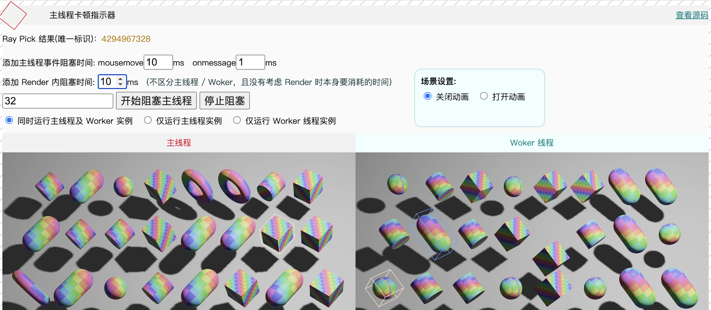

# Bevy in Web Worker
[README 中文](./zh.md)

Showcasing how to run the `Bevy` App within a `Web Worker` and the interaction between HTML elements and Bevy.

Implemented `CanvasViewPlugin` to replace `bevy_winit`, allowing the Bevy engine to run efficiently in a `Web Worker`, thereby significantly improving the application's performance and responsiveness. Additionally, it demonstrates the bidirectional communication between HTML elements and the Bevy engine, facilitating complex interaction patterns to validate the communication latency and performance when the Engine is moved into a Web Worker and interacts with the `UI thread`.

**Validation Points:**

1. Whether the event communication cost between the main thread and the Worker is high.
2. Whether the asynchronous pick interface leads to poor user interaction experience.
3. The impact of main thread blocking on events/workers.
4. The impact on experience caused by mouse events, onmessage, and render blocking.

**Design for the above validation points:**

1. No **Throttle** on the mouse event trigger frequency; every mousemove event is sent to the worker, executed by the worker for ray picking, and the result is sent back to the main thread.
2. Designed a high-complexity interaction logic for **selection/highlighting**:
    1. Main thread postMsg to the worker -> 
    2. Worker delegates the task to the engine to execute ray pick -> 
    3. Send the result from the engine to the worker -> 
    4. Worker postMsg to the main thread -> 
    5. Main thread postMsg to the worker to perform the necessary **selection/highlighting**
3. Simulated scenarios of main thread blocking with controllable frame block duration, with a **main thread stutter indicator** at the upper left corner for easy observation of blocking results.
4. The interface also provides two running instances of the main thread and the Worker thread for intuitive comparison.
5. Simulated scenarios of mousemove, onmessage, and render blocking.
6. Provided the functionality to drag scene objects by holding the left mouse button.
7. Simulated frame rendering logic of a utility App: with scene animation turned off, frame rendering is entirely driven by mouse events.

## Screenshot
 

## Running
```sh
# Compile WASM:
# Add Rust WebAssembly target
rustup target add wasm32-unknown-unknown
# Install wasm-bindgen command line tool
cargo install -f wasm-bindgen-cli --version 0.2.100

# Run:
# First install the http server
cargo install basic-http-server
# Then run using the following script
sh ./run-wasm.sh

# Build the release package
sh ./build-wasm.sh
```


## Compatible Bevy versions

| Bevy version | `bevy-in-web-worker` version |
|:-------------|:--------------------------|
| `0.16` | `0.2`                   |
| `0.14`       | `0.1`                     |